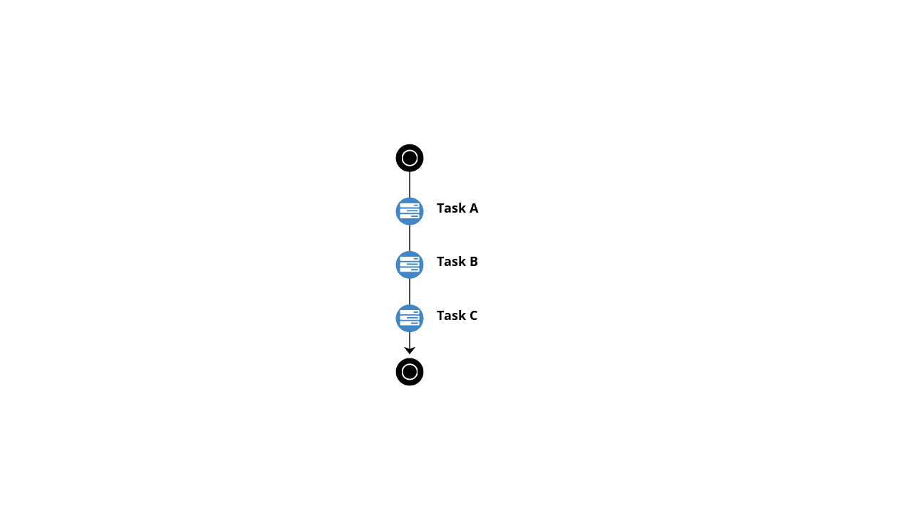
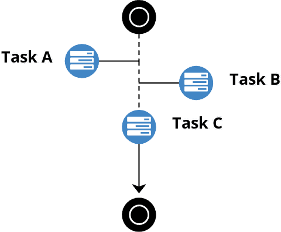

# Zenaton examples for PHP
This repository contains examples of workflows built with Zenaton. These examples illustrates how Zenaton orchestrates tasks that are executed on different workers.

## Installation
Download this repo
```
git clone https://github.com/zenaton/examples-php.git
```
and install dependencies
```
composer install
```
then populate your .env file with your application id and api token found [here](https://zenaton.com/app/api).

Then, you need to install a Zenaton worker
```
curl https://install.zenaton.com | sh
```
and start it, and make it listen to your configuration:
```
zenaton start; zenaton listen --env=.env --boot=autoload.php
```
Your all set!


*Your workflows will be processed by your worker, so you won't see anything except the stdout and stderr, respectively `zenaton.out` and `zenaton.err`. Look at these files :)*

## Example 1 : Sequential tasks execution
[This example](https://github.com/zenaton/examples-php/tree/master/Sequential) showcases
- A sequential execution of three tasks. The second task is executed only when the first one is processed and the third one after the second task execution.
- In a sequential task execution, you can get the output of a task.

<p align="center">
    
</p>

```php
php launch_sequential.php
```

## Example 2: Parallel tasks execution
[This example](https://github.com/zenaton/examples-php/tree/master/Parallel) showcases
- a parallel execution of 2 tasks
- a third task that is executed only after *both* first two tasks were processed

<p align="center">
    
</p>

```
php launch_parallel.php
```

## Example 3: Asynchronous tasks execution
[this example](https://github.com/zenaton/examples-php/tree/master/Asynchronous) showcases
- An asynchronous execution of two tasks A and B (fire and forget)
- Then a sequential execution of Task C

<p align="center">
    
</p>

```
php launch_asynchronous.php
```
When a task is dispatched asynchronously, the workflow continues its execution without waiting for the task completion. Consequently, a task asynchronous dispatching always returns a null value.

## Example 4: Event
[This example](https://github.com/zenaton/examples-php/tree/master/Event) showcases
- how to change a workflow's behaviour based on an external event

```php
php launch_event.php
```

## Example 5: Wait
[This example](https://github.com/zenaton/examples-php/tree/master/Wait) showcases
- how the provided `Wait` task can be used to pause the workflow for a specified duration

```php
php launch_wait.php
```

## Example 6: Wait Event
[This example](https://github.com/zenaton/examples-php/tree/master/WaitEvent) showcases
- how the provided `Wait` task can also be used to pause the workflow up to receiving a specific external event

```
php launch_wait_event.php
```

## Example7: Recursive Workflow
[This example](https://github.com/zenaton/examples-php/tree/master/Recursive) showcases
- how launching events or workflows directly from orchestrated tasks allows you to schedule recurring workflows

```
php launch_recursive.php
```

## Example8: Workflow Versions
[This example](https://github.com/zenaton/examples-php/tree/master/Version) showcases
- how to update your workflow implementation, even while previous versions are still running

```
php launch_version.php
```
